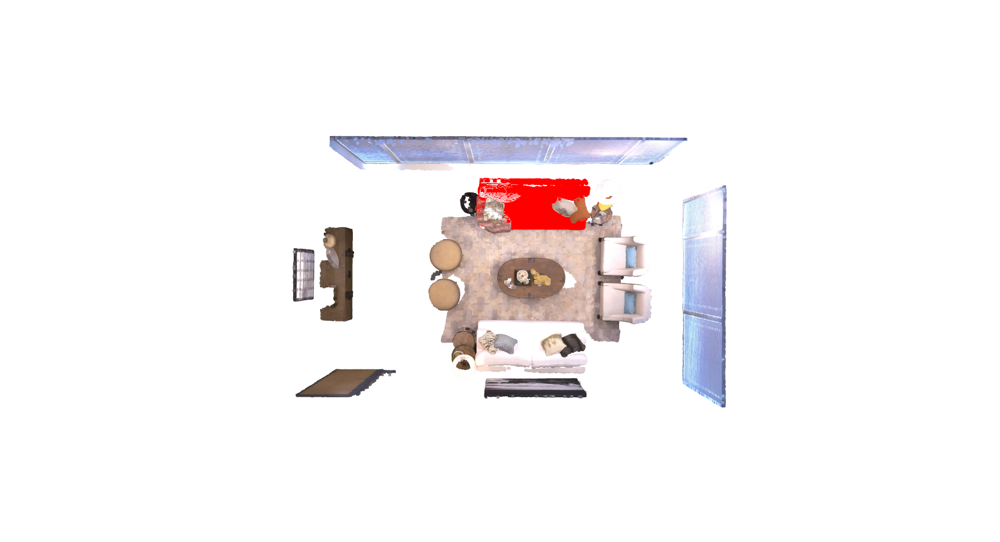
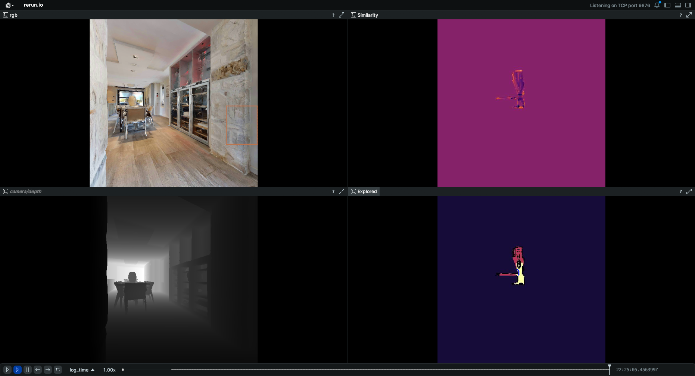
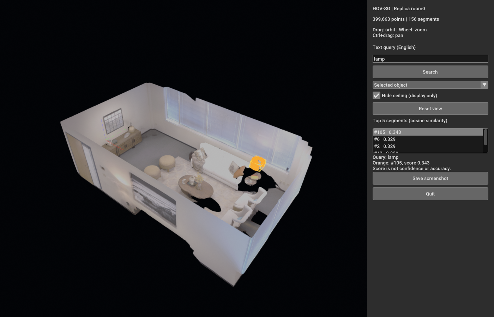
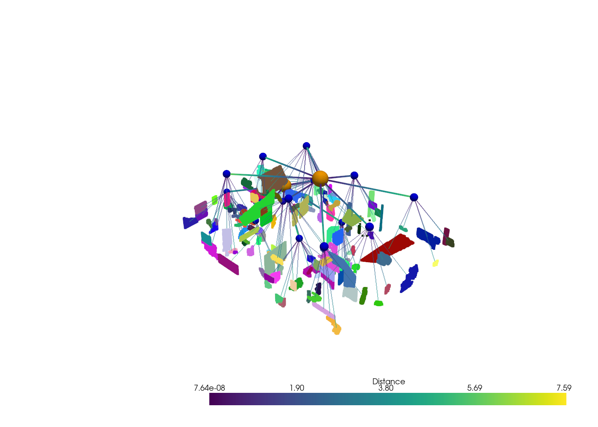

# Семантическое картирование, визуальная привязка и навигация

Практическое исследование трёх способов представления среды: объектной карты **DualMap**, семантической сетки **OneMap** и иерархического графа **HOV-SG**. Для каждого метода подготовлено окружение и запущены доступные демонстрации. Дополнительно проверена установка **VLFM**.

Основной вопрос — как связать наблюдения одного предмета из разных ракурсов, сохранить его положение и семантику, а затем найти его по запросу с пространственным уточнением: например, «ваза на столе в гостиной».

## Методы и результаты запуска

### DualMap: объектная карта и поиск по тексту

[DualMap](https://arxiv.org/abs/2506.01950) поддерживает два представления сцены. Подробная карта хранит облака точек отдельных объектов и их визуально-языковые признаки. Абстрактная карта хранит устойчивые опорные предметы и связанные с ними объекты, в том числе отношением `on`. При поиске абстрактная карта задаёт область поиска, а текущие наблюдения позволяют уточнить цель. Метод также проверяет состояние объектов при изменениях сцены.

RGB-D кадры преобразуются в 3D по глубине и позам камеры. Детектор и сегментатор выделяют предметы, а CLIP-признаки позволяют сопоставить их с текстом. Объектная карта формируется объединением наблюдений, а не генерацией облака точек трансформером.

Запущены **Offline Map Query** на готовой карте Replica `room0` и **Dataset Mode** на 200 кадрах той же сцены. Поиск отвечает на запросы `sofa`, `chair` и другие названия предметов; построение карты по последовательности завершилось успешно. [Подтверждение поиска](assets/dualmap-query.json), [результат построения](assets/dualmap-replica-200.json).



На изображении показана комната сверху. Красным выделен найденный диван, остальные поверхности сохраняют RGB-цвета. Результат запроса — выбранный объект в 3D и оценка сходства его признаков с текстом.

DualMap установлен в отдельном Conda-окружении с Python 3.10 и PyTorch 2.9/CUDA 12.8. Для готовой карты исправлены внешние подписи классов Replica. [Установка и запуск](docs/deployment/dualmap.md).

### OneMap: семантическая карта для навигации

[OneMap](https://arxiv.org/abs/2409.11764) строит двумерную сетку, в ячейках которой хранятся визуально-языковые признаки и оценка их неопределённости. Новые наблюдения обновляют карту с учётом качества измерений. Текстовая цель преобразуется в признаки и сравнивается с уже накопленной картой; при смене цели карту можно использовать повторно. Отдельно учитываются препятствия и доступные для исследования области.

Запущено штатное **Habitat demo** на публичной HM3D-сцене `00861-GLAQ4DNUx5U`. В трёх эпизодах **ObjectNav v2** с ограничением 200 шагов агент нашёл кровать; поиск туалета и дивана завершился по лимиту. Получены SR 33.33% и SPL 27.33% на этих трёх эпизодах. [Проверка Habitat](assets/onemap-habitat.json), [результат demo](assets/onemap-demo.json), [эпизоды](assets/onemap-evaluation.json).



Слева — RGB-изображение камеры и глубина. Справа — карта соответствия текстовой цели и исследованная область. Во время работы можно наблюдать, как движение камеры расширяет карту и меняет оценку положения цели.

OneMap собран в Docker на основе авторского Dockerfile. Зафиксированы совместимые версии PyTorch и зависимостей, настроен GPU-рендер Habitat. [Сборка и запуск](docs/deployment/onemap.md).

### HOV-SG: объекты, комнаты и этажи

[HOV-SG](https://arxiv.org/abs/2403.17846) выделяет маски с помощью SAM, вычисляет CLIP-признаки и переносит наблюдения в 3D. Маски из разных кадров объединяются по геометрическому перекрытию. Далее сцена разделяется на этажи и комнаты, а объектные сегменты связываются с комнатами. Получается иерархия `здание -> этаж -> комната -> объект`. Для перемещения отдельно строится навигационный граф.

На **Replica room0** построена карта по 20 кадрам, распределённым по траектории. Проверен текстовый поиск; для просмотра подготовлен интерфейс, использующий авторские функции поиска. [Построение карты](assets/hovsg-replica-20.json), [запросы](assets/hovsg-queries.json).



В центре — облако точек комнаты. Справа — запрос и список найденных сегментов; выбранный сегмент выделяется на карте. В этом режиме можно сравнить выдачу по `sofa`, `pillow`, `lamp` и увидеть, соответствует ли выбранная область целому предмету или его части.

На **HM3D `00861-GLAQ4DNUx5U`** построена иерархия по 83 RGB-D кадрам. Дополнительно проверено штатное объединение объектов готового графа: после устранения пропущенного импорта во внешнем скрипте число сегментов уменьшилось **с 683 до 611**. На неизменных объектах исходного графа получен тот же результат. [Первое построение](assets/hovsg-graph.json), [проверка объединения](assets/hovsg-merge.json), [условия сравнения и ошибка upstream](results/hovsg/merge-check/README.md).



Оранжевые узлы обозначают этажи, синие — комнаты. Цветные облака представляют объектные сегменты; линии соединяют их с соответствующими комнатами. Этажи разнесены для удобства просмотра. Стены и некоторые другие категории скрыты фильтром авторского viewer.

HOV-SG установлен через авторский Conda YAML с Python 3.9 и PyTorch 2.8/CUDA 12.8. Использованы SAM ViT-H и OpenCLIP ViT-H. [Развёртывание](docs/deployment/hovsg.md), [просмотр графа](docs/hovsg-graph-demo.md).

### VLFM: навигация по карте соответствия цели

[VLFM](https://arxiv.org/abs/2312.03275) оценивает соответствие изображений текстовой цели с помощью визуально-языковой модели. Оценки переносятся на карту и используются для выбора границ исследованной области, к которым направляется агент. Локальное движение выполняет PointNav-политика; обнаружение цели позволяет перейти к её достижению.

**На текущей машине VLFM запустить не удалось.** Штатный PyTorch 1.12.1/CUDA 11.3 не содержит вычислительных ядер для RTX 5060 Ti (`sm_120`). Реальное вычисление на GPU завершилось ошибкой `no kernel image is available`. Установленный драйвер 580.178.04 достаточно новый; несовместим именно старый программный стек метода. [Ошибка](assets/vlfm-cuda-error.json), [попытка установки](docs/deployment/vlfm.md).

## Исследовательская проблема

В HOV-SG маски создаются для отдельных изображений, а затем объединяются в 3D. Части одного предмета могут получить разные маски и названия. Проверенное дополнительное объединение сократило число сегментов с 683 до 611, а сегментов с меткой `couch` — с восьми до шести. В рассматриваемой области визуально различимы два дивана; соответствие каждого сегмента этим предметам ещё требует разметки. Это наблюдение указывает на проблему согласования объектов, но само по себе не устанавливает причину ошибки.

Видеосегментация позволяет учитывать предыдущие кадры, однако её результат также нужно проверять по пространственной структуре сцены. Рассмотрим ситуацию: два дивана сначала наблюдаются раздельно, а после поворота камеры и частичного перекрытия сегментатор выдаёт одну общую маску. В карте уже есть сведения о двух предметах, но при одностороннем обновлении ошибочная маска может испортить их представления.

**Исследовательский вопрос:** как использовать накопленную 3D-карту для обнаружения и исправления ошибок сегментации новых кадров, сохраняя возможность добавлять ранее невидимые поверхности и предметы?

Рабочая тема:

> **Повышение устойчивости объектного семантического картирования с помощью обратной связи между 3D-картой и видеосегментацией.**

## Гипотеза и предполагаемое решение

**Гипотеза:** повторная сегментация с подсказками из геометрически проверенной объектной карты уменьшает ошибочные объединения и смены идентичности объектов при перекрытиях и изменениях ракурса по сравнению с той же видеосегментацией без обратной связи. Улучшение должно сохраняться без существенной потери полноты восстановленных объектов.

Предлагается замкнуть процесс обновления:

```text
RGB-D кадр + положение камеры
    -> видеосегментация и предварительное сопоставление объектов
    -> сравнение масок с проекциями объектов 3D-карты
    -> повторная сегментация спорных областей с подсказками из карты
    -> проверка результата и обновление карты
```

### Как работает обратная связь

На вход поступают RGB, глубина, параметры камеры и её положение. Каждый объект карты хранит наблюдённую геометрию, семантические признаки и историю подтверждений. Видеомодель выдаёт маски и временные ID; соответствие этих ID объектам карты проверяется отдельно.

1. **Предсказать видимую часть объекта.** Геометрия карты проецируется в текущий кадр. Предсказанная глубина сравнивается с измеренной: если перед объектом находится другая поверхность, закрытая часть исключается из проверки. Участки с пропусками глубины или недостаточной плотностью карты остаются неопределёнными.
2. **Обнаружить противоречие.** Проверяется перекрытие масок с надёжными проекциями и согласованность глубины. Поводом для проверки может стать одна маска, покрывающая два ранее раздельно наблюдавшихся предмета, или неожиданное разделение известного объекта. Это сигнал для повторной обработки, а не автоматическое доказательство ошибки сегментатора.
3. **Сформировать подсказки.** Положительные точки выбираются внутри надёжной видимой проекции нужного объекта. Отрицательные — внутри подтверждённого соседнего объекта. Неизвестные области и закрытые поверхности отрицательными подсказками не становятся. Спорная область повторно обрабатывается сегментатором, поддерживающим такие подсказки.
4. **Проверить исправленную маску.** Сохраняются исходный и исправленный варианты. Сравниваются их согласованность с измеренной глубиной, надёжными участками карты и соседними кадрами. Одного улучшения совпадения с картой недостаточно: иначе алгоритм будет воспроизводить её прежние ошибки. При неразрешённом противоречии наблюдение сохраняется отдельно, без немедленного изменения объекта.
5. **Обновить объект.** Принятая маска добавляет геометрию и семантические признаки к соответствующему предмету. Новые поверхности вне существующей проекции допускаются, если согласуются с текущими измерениями. После обновления можно уточнять принадлежность комнате и пространственные отношения.

В примере с диванами карта задаёт отдельные подсказки для каждого предмета и позволяет проверить, можно ли разделить общую маску. При перекрытии дивана столом проверка глубины помогает отличить закрытую поверхность от ошибочно пропавшей части объекта.

**Предлагаемое решение пока не реализован и не проверен, также отсутствует математическая формализация.** 
Один из возможных путей улучшения — использование SAM 2 или SAM 3, поддерживающих сегментацию и отслеживание объектов в видеопоследовательностях. Учёт предыдущих кадров может повысить согласованность масок одного объекта между наблюдениями.


## Запуск демонстраций

Команды выполняются из корня репозитория в подготовленном окружении.

```bash
make dualmap-query       # F: ввод запроса в терминале; Q: выход
make hovsg-demo          # карта Replica и текстовый поиск
make hovsg-graph-merged  # граф HM3D после дополнительного объединения
```

Для OneMap сначала откройте viewer:

```bash
make onemap-viewer
```

В другом терминале запустите демонстрацию:

```bash
make onemap-demo
```

Для установки на другом компьютере: [общая подготовка](docs/deployment/README.md), [данные и веса](docs/datasets.md). Проверенная конфигурация — Ubuntu 24.04.3, RTX 5060 Ti 16 GB, около 30 GiB RAM. Исходники методов закреплены Git submodules; команды `make submodules`, `make doctor` и `make status` инициализируют проекты, проверяют хост и показывают состояние запусков.

## Источники

Статьи и код: [DualMap](https://arxiv.org/abs/2506.01950) / [репозиторий](https://github.com/Eku127/DualMap), [OneMap](https://arxiv.org/abs/2409.11764) / [репозиторий](https://github.com/KTH-RPL/OneMap), [HOV-SG](https://arxiv.org/abs/2403.17846) / [репозиторий](https://github.com/hovsg/HOV-SG), [VLFM](https://arxiv.org/abs/2312.03275) / [репозиторий](https://github.com/rai-opensource/vlfm).

Близкие направления: многоракурсная ассоциация в [ConceptGraphs](https://arxiv.org/abs/2309.16650), выбор детализации объектов в [Clio](https://arxiv.org/abs/2404.13696), [OVIP-SG](https://arxiv.org/abs/2608.17633) и [TRACKGRAPH](https://arxiv.org/abs/2609.31005). Новизну предлагаемого правила ещё предстоит установить при подробном сопоставлении с этими работами.
