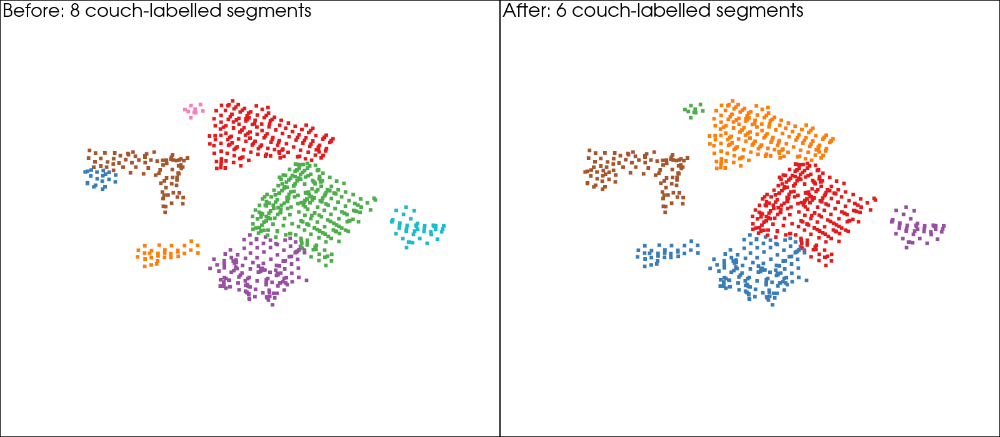

# Проверка дополнительного объединения HOV-SG

Проверена опция `pipeline.merge_objects_graph=true` на HM3D `00861-GLAQ4DNUx5U`. Использована та же карта признаков из 83 RGB-D кадров, что и в [первом запуске](../graph-demo/README.md). SAM и CLIP повторно не извлекали признаки; этажи, комнаты, объекты и навигационный граф перестроены авторским `Graph.build_graph`.

## Результат

Штатная ветка завершилась с `NameError: name 'find_overlapping_ratio' is not defined`: в `hovsg/graph/room.py` отсутствует импорт функции. [Traceback](native-error.txt).

Повтор с подключением **существующей** `hovsg.utils.eval_utils.find_overlapping_ratio` во внешнем процессе завершился с кодом 0. Исходники submodule не менялись. Это запуск с исправленным импортом, а не успешный запуск неизменённого приложения.

| Проверка | До | После |
|---|---:|---:|
| Сохранённые объектные сегменты | 683 | 611 |
| Сегменты с меткой `couch` | 8 | 6 |
| Этажи / комнаты | 2 / 14 | 2 / 14 |
| Компоненты навигационного графа | 4 | 4 |

Отдельно вызван тот же `Room.merge_objects` на неизменных объектах исходного графа: также **683 -> 611**. Это отделяет эффект объединения от повторной сегментации комнат. [Сравнение по комнатам и названиям](fixed-input-comparison.json), [проверка сохранённого графа](summary.json).

Уникальность ID, принадлежность объектов комнатам, непустые облака и конечность признаков проверены. Объединение сохранило все 154 952 уникальные точки исходных объектных облаков; сокращение числа сегментов не связано с удалением геометрии. Авторский viewer открыл граф и завершился с кодом 0: [подтверждение](gui-check.json).




На парном изображении показана одна и та же область с одной камерой; цвет обозначает отдельный сегмент. Палитра назначена заново в каждом столбце, поэтому одинаковый цвет не обозначает соответствие между столбцами. Это все сегменты с предсказанной меткой `couch` в комнате `0_2`, а не разметка настоящих диванов.

## Что делает проход

`Room.merge_objects` проверяет пары **внутри одной комнаты** с **одинаковыми названиями**. Для каждой пары вычисляется доля точек, имеющих соседа в другом облаке ближе 0.1 м. При доле больше 0.01 запускается объединение облаков и усреднение признаков. Пороги оставлены авторскими.

Отсюда следует ограничение: части с разными предсказанными названиями этим проходом не объединяются. Само сокращение числа сегментов не доказывает исправление физических экземпляров: для этого нужна разметка. Этот опыт подтверждает работоспособность прохода после исправления импорта, но не преимущество предлагаемой гипотезы.

Важная особенность кода: `build_graph` печатает `len(self.objects)` — старое число 683. Объединённые списки находятся в `room.objects`; из них создаётся и сохраняется граф с 611 объектами. Для последующего поиска следует заново загрузить сохранённый граф, а не использовать оставшийся старый список в памяти.

## Команды

Посмотреть сохранённый результат:

```bash
make hovsg-graph-merged
```

Повторить построение из сохранённой карты признаков (требуются локальные данные, веса и окружение):

```bash
cd third_party/HOV-SG

export MPLCONFIGDIR="$PWD/../../data/cache/hovsg/matplotlib"
export OMP_NUM_THREADS=4
export OPENBLAS_NUM_THREADS=4
export PYTORCH_CUDA_ALLOC_CONF=expandable_segments:True

../../.local/envs/hovsg/bin/python \
  ../../results/hovsg/merge-check/run.py \
  --provide-missing-import
```

Без `--provide-missing-import` воспроизводится штатная ошибка. Каждый повтор пишет в новый каталог и печатает путь к графу. Посмотреть его из корня репозитория можно через `HOVSG_GRAPH_DIR="/путь/из/вывода/graph" make hovsg-graph-demo`.

Первый диагностический вызов из корня репозитория остановился раньше на относительном пути labels CSV; поэтому повтор выполнялся из `third_party/HOV-SG`. Логи сохранены локально в `logs/`, полные карты — в `raw/`.

Исходники: [Room.merge_objects](../../../third_party/HOV-SG/hovsg/graph/room.py), [overlap](../../../third_party/HOV-SG/hovsg/utils/eval_utils.py), [Graph.build_graph / create_graph](../../../third_party/HOV-SG/hovsg/graph/graph.py). Commit HOV-SG: `d6e65a53c8be6faec3f01f00d1644d967f89e605`.
